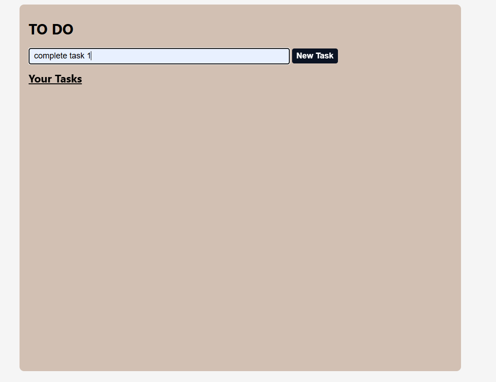
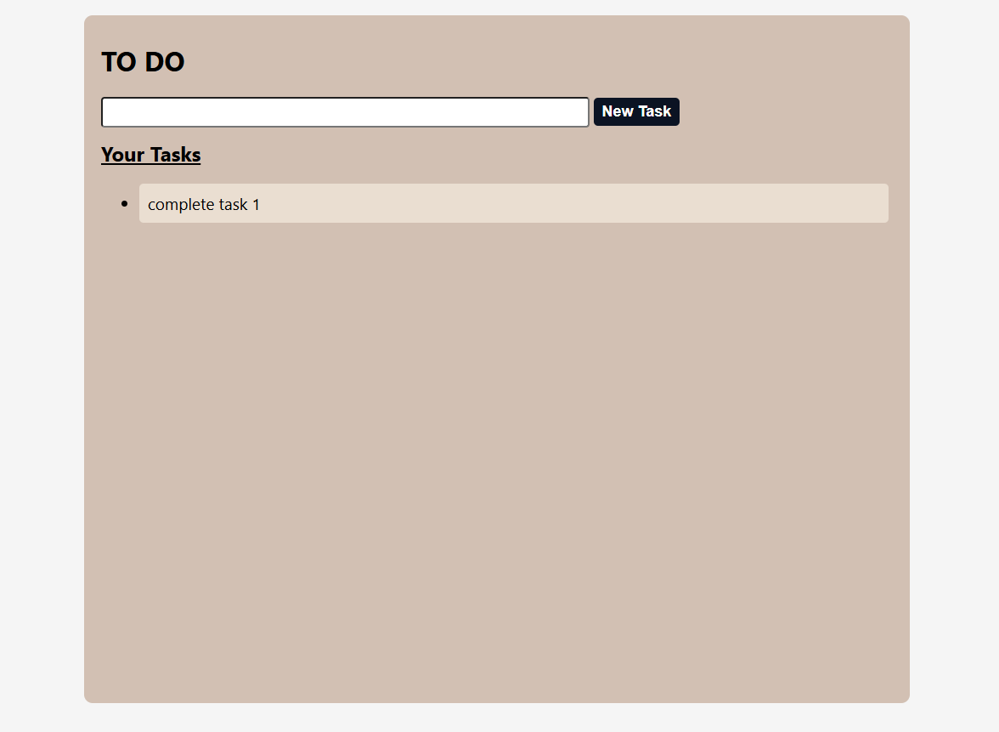
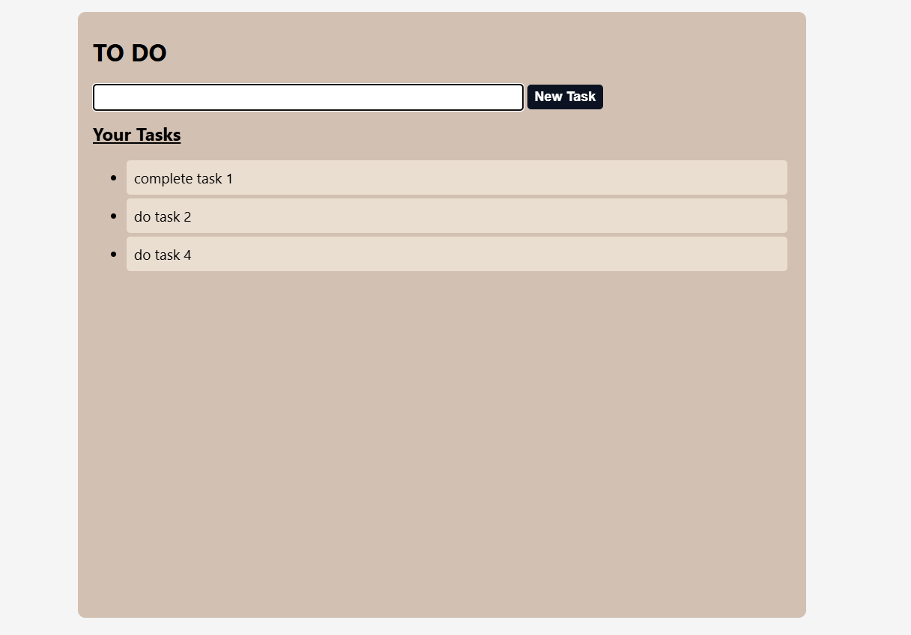
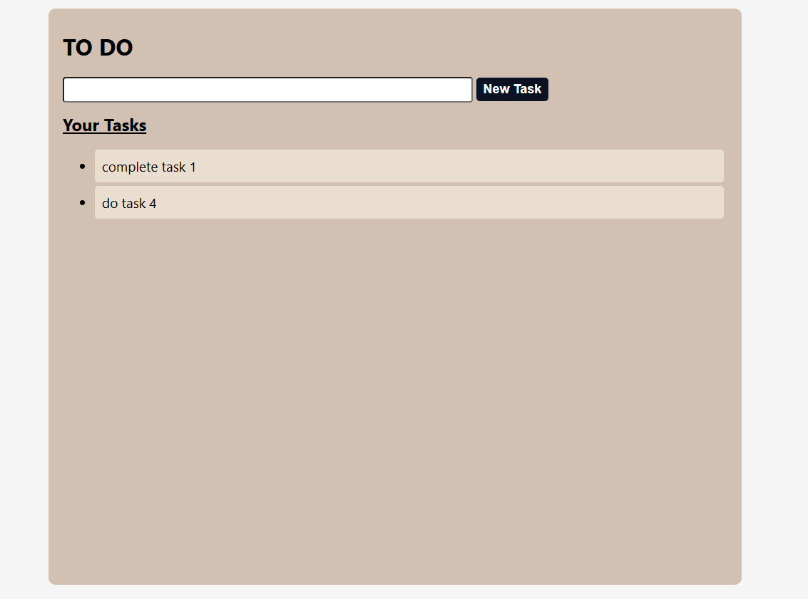

# A2SV-Web-track
This a Todo app that saves what you planned to do.
The way to use it is easy 
- Your write your note in the black space them press New Task to save when finished
- You can remove once done by clicking on the saved tasks
## Screenshot of Task 1
Write your notes

click New task

add more if you want

Delete when finished by clicking on the task saved

