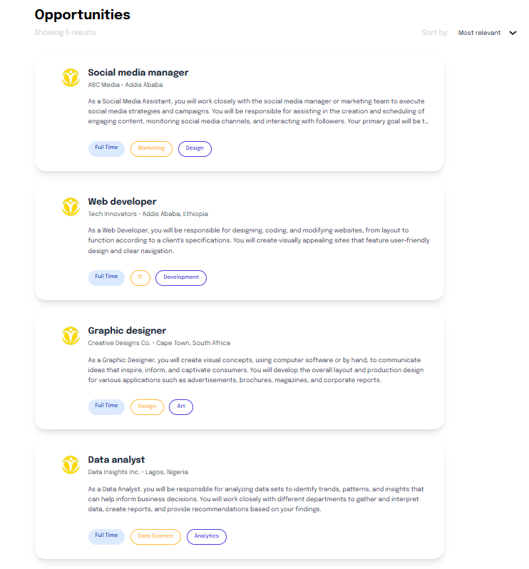

# Job Listing Application

A modern job listing application built with Next.js and TypeScript. This application allows users to browse job opportunities, sort them by relevance or date, and view detailed information about each job posting.

## Features

- **Job Listings**: Browse through various job opportunities with clean, card-based UI
- **Sorting Options**: Sort jobs by relevance, newest first, or oldest first
- **Responsive Design**: Optimized for both desktop and mobile viewing
- **Detailed Job View**: Click on any job card to view comprehensive details about the position

## Screenshots

### Home Page



### Detailed Job View


## Technologies Used

- **Next.js**: React framework for server-rendered applications
- **TypeScript**: For type-safe code
- **Tailwind CSS**: For styling and responsive design

## Project Structure

```
app/
├── components/       # Reusable UI components
│   ├── Card.tsx     # Job card component for listings
│   └── DetailedJob.tsx # Detailed job view component
├── detailed/        # Detailed job view page
│   └── page.tsx     # Detailed job page component
├── globals.css      # Global styles
├── jobs.json        # Sample job data
├── layout.tsx       # Root layout component
└── page.tsx         # Home page component with job listings
```

## Features Explained

### Job Listings

The home page displays a list of job opportunities in card format. Each card shows:
- Job title
- Company name and location
- Brief job description
- Tags indicating job type and categories

### Job Details

Clicking on a job card navigates to a detailed view that includes:
- Comprehensive job description
- List of responsibilities
- Ideal candidate profile
- Event details (when and where)
- Additional information such as posting date, deadline, location, etc.
- Required skills


