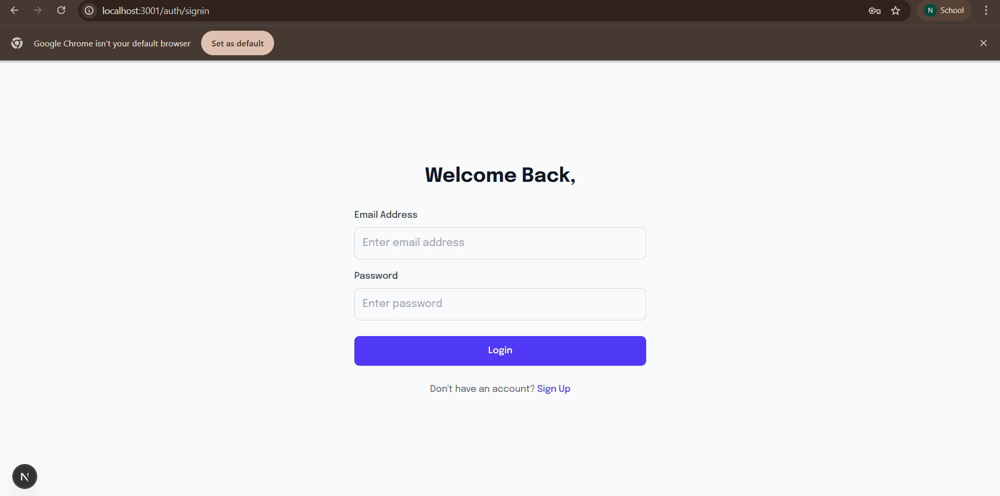

# Task 8: User Authentication Implementation

This project implements a complete authentication system using NextAuth.js with the provided backend API endpoints. The application includes signup, signin, and email verification functionality.

## Features Implemented

### 1. User Registration (Signup)
- **Form Validation**: Client-side validation for all required fields
- **Password Confirmation**: Ensures passwords match
- **Email Validation**: Validates email format
- **Role Selection**: Users can select their role (user, admin, employer)
- **API Integration**: Connects to the provided signup endpoint
- **Error Handling**: Displays appropriate error messages

### 2. Email Verification
- **OTP Input**: 4-digit verification code input with auto-focus
- **Resend Functionality**: Countdown timer for resending OTP
- **API Integration**: Connects to the verify-email endpoint
- **Success Redirect**: Redirects to signin page after successful verification

### 3. User Authentication (Signin)
- **Form Validation**: Email format and required field validation
- **NextAuth Integration**: Uses NextAuth.js for session management
- **Access Token Storage**: Securely stores access tokens
- **Error Handling**: Displays authentication errors
- **Success Messages**: Shows verification success messages

### 4. Protected Routes
- **Middleware Protection**: All routes except auth pages require authentication
- **Automatic Redirects**: Unauthenticated users are redirected to signin
- **Session Management**: Persistent sessions with JWT tokens

## API Endpoints Used

- **Base URL**: `https://akil-backend.onrender.com/`
- **Signup**: `POST /signup`
- **Email Verification**: `POST /verify-email`
- **Sign In**: `POST /login`

## Screenshots

### 1. Signup Page

**Description**: The signup page features a clean, modern design with Google signup option, form validation, and role selection. Users can enter their full name, email, password, confirm password, and select their role. The form includes client-side validation for all fields and displays appropriate error messages.

### 2. Signin Page

**Description**: The signin page provides a streamlined authentication experience with email and password fields. It includes form validation, success messages for email verification, and links to the signup page. The design is consistent with the signup page for a cohesive user experience.

### 3. Email Verification Page

**Description**: The email verification page displays a 4-digit OTP input interface with individual input boxes for each digit. It includes a countdown timer for resending the verification code and clear instructions for users. The page handles verification errors gracefully and redirects to signin upon success.

### 4. Main Dashboard (Protected Route)

**Description**: The main dashboard shows the job listings with authentication-protected access. The navbar displays the user's name and sign-out option for authenticated users. Unauthenticated users are automatically redirected to the signin page.

## Technical Implementation

### Client-Side Validation
- Email format validation using regex
- Password length validation (minimum 6 characters)
- Required field validation
- Password confirmation matching

### Security Features
- Secure token storage using NextAuth.js
- Protected routes with middleware
- CSRF protection through NextAuth
- Secure password handling

### User Experience
- Loading states during API calls
- Clear error and success messages
- Responsive design for all screen sizes
- Intuitive navigation flow
